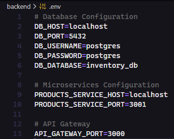

<p align="center">
  <a href="http://nestjs.com/" target="blank"></a>
</p>

[circleci-image]: https://img.shields.io/circleci/build/github/nestjs/nest/master?token=abc123def456
[circleci-url]: https://circleci.com/gh/nestjs/nest

  <p align="center">A progressive <a href="http://nodejs.org" target="_blank">Node.js</a> framework for building efficient and scalable server-side applications.</p>
    <p align="center">
<a href="https://www.npmjs.com/~nestjscore" target="_blank"></a>
<a href="https://www.npmjs.com/~nestjscore" target="_blank"></a>
<a href="https://www.npmjs.com/~nestjscore" target="_blank"></a>
<a href="https://circleci.com/gh/nestjs/nest" target="_blank"></a>
<a href="https://discord.gg/G7Qnnhy" target="_blank"></a>
<a href="https://opencollective.com/nest#backer" target="_blank"></a>
<a href="https://opencollective.com/nest#sponsor" target="_blank"></a>
  <a href="https://paypal.me/kamilmysliwiec" target="_blank"></a>
    <a href="https://opencollective.com/nest#sponsor"  target="_blank"></a>
  <a href="https://twitter.com/nestframework" target="_blank"></a>
</p>

# Sistema de Inventario (NestJS + Microservicios)

Proyecto para gestionar un inventario de productos usando arquitectura de microservicios con NestJS.

## Arquitectura

- **API Gateway** (HTTP, puerto 3000): expone los endpoints REST.
- **Microservicio de Productos** (TCP, puerto 3001): lógica de negocio.
- **PostgreSQL** (puerto 5432): base de datos orquestada con Docker.

## Requisitos

- Node.js 20+
- Docker y Docker Compose
- npm

## Instalación

```bash
# Instalar dependencias
npm install
```

## Configuración

Crear un archivo `.env` en la raíz del proyecto con las siguientes variables:

```env
# Base de datos
DB_HOST=localhost
DB_PORT=5432
DB_USERNAME=postgres
DB_PASSWORD=postgres
DB_DATABASE=inventory_db

# Microservicio de Productos
PRODUCTS_SERVICE_HOST=localhost
PRODUCTS_SERVICE_PORT=3001

# API Gateway
API_GATEWAY_PORT=3000
```



## Ejecución Local

### Opción 1: Sin Docker (Node.js local)

#### Prerequisitos:
- PostgreSQL ejecutándose en tu máquina (puerto 5432)
- O levantar solo PostgreSQL con Docker:

**Terminal 1 - Base de Datos:**
```bash
docker run --name postgres-inventory -e POSTGRES_PASSWORD=postgres -e POSTGRES_DB=inventory_db -p 5432:5432 -d postgres
```

> **Nota:** Este comando crea un contenedor PostgreSQL con la BD `inventory_db`. Espera unos segundos a que se inicie completamente antes de ejecutar los servicios.

#### Iniciar los servicios:

**Terminal 2 - API Gateway:**
```bash
npm run start:gateway
```

**Terminal 3 - Microservicio de Productos:**
```bash
npm run start:products
```

La API estará disponible en: `http://localhost:3000`

### Opción 2: Con Docker Compose (Recomendado)

```bash
# Levantar todos los servicios (Gateway, Productos, PostgreSQL)
docker-compose up

# Ver logs
docker-compose logs -f

# Detener servicios
docker-compose down
```

La API estará disponible en: `http://localhost:3000`

## Tests

```bash
# Ejecutar todos los tests
npm test

# Ejecutar tests con cobertura
npm run test:cov

# Ejecutar tests en modo vigilancia
npm run test:watch
```

## Documentación (Swagger)

- Gateway / App raíz: `http://localhost:3000/api/swagger`
- Incluye ejemplos de request/response y schemas de productos.

## Endpoints

### 1. Listar todos los productos

**GET** `/api/products`

**Respuesta exitosa (200):**
```json
[
  {
    "id": "550e8400-e29b-41d4-a716-446655440000",
    "name": "Laptop HP",
    "price": 899.99,
    "stock": 15
  },
  {
    "id": "6ba7b810-9dad-11d1-80b4-00c04fd430c8",
    "name": "Mouse Logitech",
    "price": 25.50,
    "stock": 50
  }
]
```

### 2. Crear un producto

**POST** `/api/products`

**Body (JSON):**
```json
{
  "name": "Teclado Mecánico",
  "price": 129.99,
  "stock": 30
}
```

**Respuesta exitosa (201):**
```json
{
  "id": "7c9e6679-7425-40de-944b-e07fc1f90ae7",
  "name": "Teclado Mecánico",
  "price": 129.99,
  "stock": 30
}
```

### 3. Eliminar un producto

**DELETE** `/api/products/:id`

**Respuesta exitosa (200):**
```json
{
  "message": "Producto eliminado exitosamente"
}
```

## Modelo de Datos

### Tabla: products

| Campo | Tipo | Descripción |
|-------|------|-------------|
| `id` | UUID | Identificador único (clave primaria) |
| `name` | VARCHAR | Nombre del producto (requerido) |
| `price` | DECIMAL | Precio del producto (requerido) |
| `stock` | INTEGER | Cantidad en inventario (requerido) |

## Solución de Problemas

- **No conecta a la BD**: Verifica que el contenedor de PostgreSQL esté ejecutándose con `docker ps` y espera unos segundos después de iniciarlo.
- **El Gateway no responde**: Asegúrate de iniciar primero el microservicio de productos (puerto 3001) antes del Gateway.
- **Errores de dependencias**: Ejecuta `npm install --legacy-peer-deps` para resolver conflictos de versiones.
